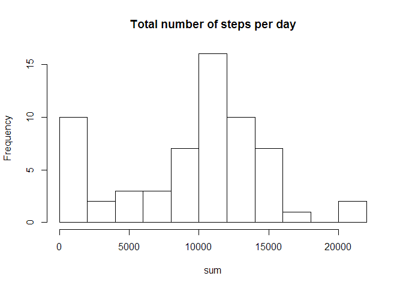
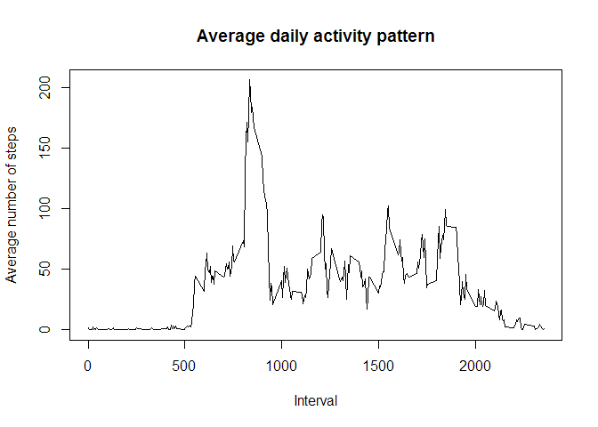
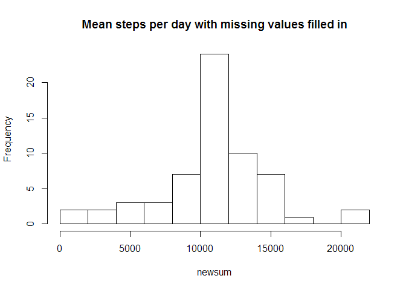
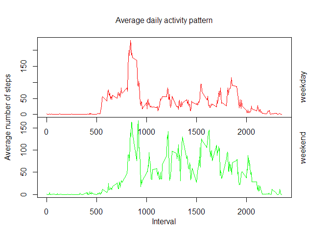

# Reproducible Research: Peer Assessment 1


## Loading and preprocessing the data

To load the data:

```r
activityData <- read.csv("activity.csv")
summary(activityData)
```

```
##      steps                date          interval     
##  Min.   :  0.00   2012-10-01:  288   Min.   :   0.0  
##  1st Qu.:  0.00   2012-10-02:  288   1st Qu.: 588.8  
##  Median :  0.00   2012-10-03:  288   Median :1177.5  
##  Mean   : 37.38   2012-10-04:  288   Mean   :1177.5  
##  3rd Qu.: 12.00   2012-10-05:  288   3rd Qu.:1766.2  
##  Max.   :806.00   2012-10-06:  288   Max.   :2355.0  
##  NA's   :2304     (Other)   :15840
```

```r
head(activityData)
```

```
##   steps       date interval
## 1    NA 2012-10-01        0
## 2    NA 2012-10-01        5
## 3    NA 2012-10-01       10
## 4    NA 2012-10-01       15
## 5    NA 2012-10-01       20
## 6    NA 2012-10-01       25
```
I decided to convert the "date" column into the Date format.

```r
activityData$date <- as.Date(activityData$date)
```
Now the data is ready to use.
## What is mean total number of steps taken per day?
I split the data by day, then summed the steps on each day.

```r
a <- split(activityData, activityData$date)
sum <-sapply(a, function(x) {sum(x[, c("steps")], na.rm = TRUE)})
```
 

The mean number of steps a day is 9354.2295082 and the median is 10395.

## What is the average daily activity pattern?
To plot the daily activity pattern I split the data by interval then found the mean for each interval.

```r
interval<-unique(activityData$interval)
b<- split(activityData,interval)
pattern <- sapply(b, function(x) {mean(x[, c("steps")], na.rm = TRUE)})
```
 

The 5 minute interval is interval 835 with 206.1698113 steps.

## Imputing missing values


The number of rows containing NAs is 2304.
I decided to fill in the missing values with the interval average.

```r
completeActivityData<-activityData
completeActivityData$steps <- ifelse(is.na(completeActivityData$steps), d$pattern[match(completeActivityData$interval, d$interval)], completeActivityData$steps)
```

Now the number of rows containing NAs is 0.

```r
m <- split(completeActivityData, completeActivityData$date)
newsum <-sapply(m, function(x) {sum(x[, c("steps")], na.rm = TRUE)})
```
 

The mean number of steps a day is 10766.19 and the median is 10766.19. Compare that to the old mean:  9354.23 and median: 10395. The new results are higher.

## Are there differences in activity patterns between weekdays and weekends?
I created a new column "weekday" that contains TRUE on a weekday and FALSE on the weekend

```r
completeActivityData$weekday<-weekdays(completeActivityData$date)
completeActivityData$weekday<-ifelse(completeActivityData$weekday %in% c("Monday", "Tuesday", "Wednesday", "Thursday", "Friday"), TRUE, FALSE)
```
I then split my data into two data frames and used the same pattern formulas I used earlier to both.

```r
weekdaydata<-completeActivityData[completeActivityData$weekday,]
weekenddata<-completeActivityData[!completeActivityData$weekday,]
weekdaysplit<- split(weekdaydata,weekdaydata$interval)
weekendsplit<- split(weekenddata,weekenddata$interval)
weekdaypattern <- sapply(weekdaysplit, function(x) {mean(x[, c("steps")], na.rm = TRUE)})
weekendpattern <- sapply(weekendsplit, function(x) {mean(x[, c("steps")], na.rm = TRUE)})
```
 


